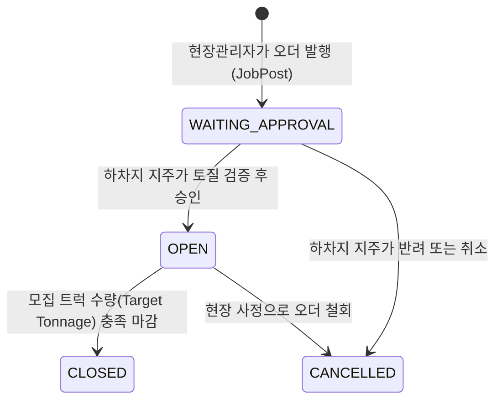
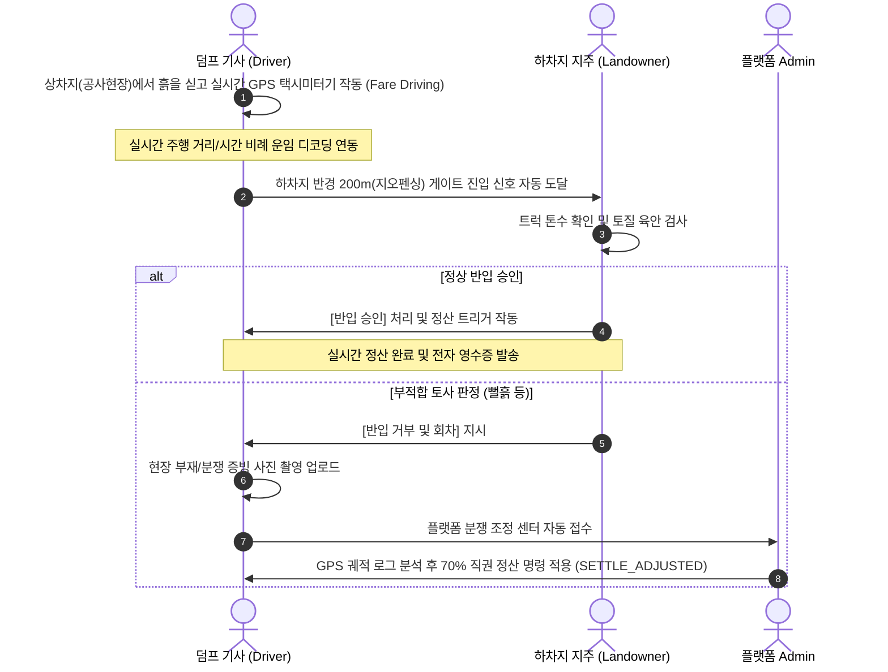

# 💻 덤프링(Dumpring) 시스템 운영 프로세스 & 공통 코드 명세서

본 문서는 개발자 및 운영자를 위해 덤프링 플랫폼의 핵심 **운영 비즈니스 라이프사이클(State Machine)**과 데이터베이스에서 활용되는 **마스터 공통 코드표**를 정의한 기술 명세서입니다.

---

## 1. ⚙️ 핵심 비즈니스 운영 프로세스 (Operational Lifecycles)

덤프링의 비즈니스 흐름은 **현장 오더 발행 ➔ 지주 승인 ➔ 기사 배차 및 미터기 운행 ➔ 하차지 반입 승인 ➔ 정산 및 분쟁 중재**로 이어지는 견고한 트랜잭션 흐름을 갖습니다.

### 🔄 B2B 매칭 및 배차 모집 라이프사이클

1. **오더 신청 (`WAITING_APPROVAL`)**: 현장 관리자(Site Manager)가 하차지가 올린 '매립 수용 공고'를 보고 필요한 덤프 트럭 수량 및 작업 날짜를 지정하여 오더를 넣습니다.
2. **지주 심사 및 승인 (`OPEN`)**: 하차지 지주가 본인 사토장의 토사 반입 잔여량 및 요청된 토종(뻘흙 등 부적합 여부)을 육안/서류 검증 후 최종 승인하면 기사 앱에 즉시 공고가 배포됩니다.
3. **매칭 마감 (`CLOSED`)**: 신청 대수만큼 기사가 배차를 완료하면 자동으로 모집이 마감됩니다.

---

### 🚖 실시간 GPS 미터기 및 게이트 반입 승인 프로세스

---

## 2. 📊 데이터베이스 마스터 공통 코드표 (Common Code Tables)

데이터베이스의 공통 코드 테이블(`common_codes`) 및 엔티티의 상태(Status) 필드 구조 정의서입니다.

### ① 사용자 역할 권한 코드 (User Role Flags)
| 구분 필드명 (Boolean) | 역할 명칭 | 부여 권한 및 비즈니스 경계 |
| :--- | :--- | :--- |
| `is_site_manager` | 공사현장 관리자 | 현장 개설 권한, 소속 담당자 승인/반려 권한, B2B 매칭 오더 발행 권한 |
| `is_site_worker` | 현장 담당자 | 소속 현장 매핑 신청 권한, 현장 출입 덤프 차량 관제 및 게이트 통제 |
| `is_owner` | 덤프 차주 | 덤프 차량 등록, 소속 운전기사 번호 선등록(초대) 및 연동 배정 권한 |
| `is_driver` | 덤프 기사 | 배차 콜 수락, 실시간 GPS 미터기 주행, 전자 영수증 및 운행 이력 확인 |
| `is_drop_off` | 하차지 지주 | 하차지 사토장 개설, 매립 수용 공고 게시, 현장 B2B 오더 최종 승인/반려 |
| `is_admin` | 플랫폼 어드민 | 신규 회원 가입 심사, 배차 강제 개입 통제, 분쟁 GPS 분석 직권 중재 |

---

### ② B2B 매칭 오더 상태 코드 (JobPost / Order Status)
| 상태 코드 (Status) | 명칭 | 설명 |
| :--- | :--- | :--- |
| **`WAITING_APPROVAL`** | 하차지 승인 대기 | 현장 관리자가 발행 직후 상태 (기사들에게 노출되지 않음) |
| **`OPEN`** | 모집 진행 중 (승인 완료) | 하차지 지주가 승인을 완료하여 기사들에게 배차 모집 공고로 노출된 상태 |
| **`CLOSED`** | 매칭 마감 | 목표한 모집 덤프 트럭 대수가 모두 충족되어 모집이 완료된 상태 |
| **`CANCELLED`** | 오더 취소 | 현장 사정으로 취소되었거나 지주에 의해 반려된 상태 |

---

### ③ 토사 종류 공통 코드 (Group: `MATERIAL_TYPE`)
| 코드 (Code) | 코드 명칭 | 디스플레이 순서 | 설명 |
| :--- | :--- | :---: | :--- |
| **`GOOD_SOIL`** | 양질토 | 1 | 도로 및 성토용으로 가장 적합한 양질의 흙 |
| **`MUD_SOIL`** | 뻘흙 | 2 | 점성이 강해 하차지 반입 시 정밀 검사가 필요한 토사 |
| **`ROCK`** | 암버럭 | 3 | 발파 및 굴착 작업 시 발생하는 돌덩어리 및 암석 |
| **`MIXED`** | 혼합토 | 4 | 흙과 암석이 혼재된 복합 토사 |

---

### ④ 덤프 트럭 톤수 공통 코드 (Group: `TRUCK_TYPE`)
| 코드 (Code) | 코드 명칭 | 규격 기준 | 설명 |
| :--- | :--- | :--- | :--- |
| **`T_25`** | 25톤 덤프 | 25.5 톤 수용 | 고중량 장거리 수송용 메인 덤프 |
| **`T_15`** | 15톤 덤프 | 15.0 톤 수용 | 도심지 좁은 도로 진입용 소형 덤프 |
| **`T_27`** | 27톤 덤프 | 27.0 덤프 / 트레일러 | 초고용량 특수 수송 차량 |

---

### ⑤ 지불 및 정산 방식 공통 코드 (Group: `PAYMENT_POLICY`)
#### 지불 주체 (`PAYER_TYPE`)
* **`SITE_PAYS`**: 상차지(공사 현장)에서 운송비를 직접 지불합니다.
* **`DROP_OFF_PAYS`**: 하차지(사토장 지주)가 토사 수급을 위해 비용을 지불합니다.
* **`FREE`**: 무상 토사 수용 조건으로 운송비 거래가 발생하지 않습니다.

#### 정산 주기 (`PAYMENT_METHOD`)
* **`DAILY`**: 당일 주행 운임 정산 완료 후 기사 지갑으로 당일 지급 처리.
* **`MONTHLY`**: 한 달 단위로 마감 취합하여 세금계산서 발행 후 월말 일괄 정산.

---

### ⑥ 현장 직원 매핑 심사 코드 (SiteUserStatus)
* **`PENDING`**: 담당자 가입 후 소장의 승인을 대기하는 초기 단계.
* **`APPROVED`**: 소장이 승인을 완료하여 현장 통제 권한을 획득한 상태.
* **`REJECTED`**: 소속 정보 불일치 등으로 거부 처리된 상태.

---
> [!TIP]
> 백엔드 REST API 명세와 연동할 때 해당 상태 코드 문자열값을 정확히 매칭해 주셔야 데이터베이스 제약 조건 오류가 발생하지 않습니다. 
