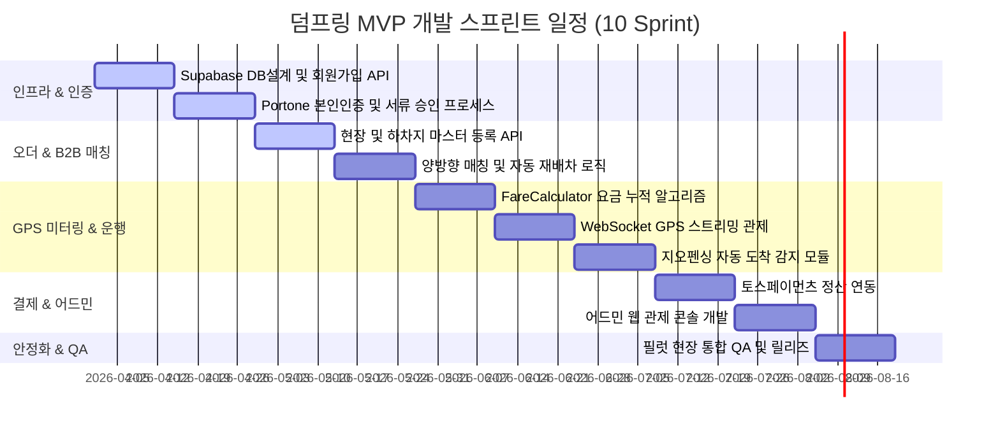
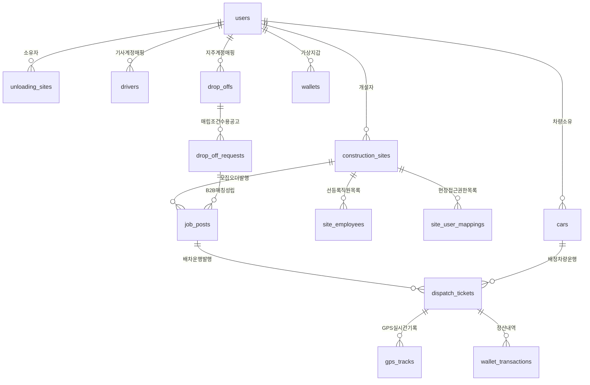
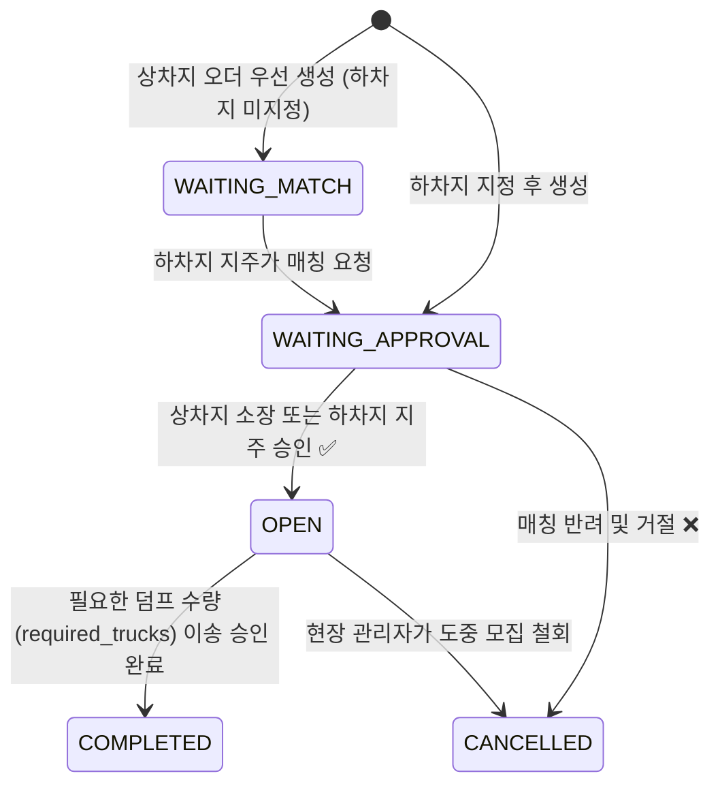
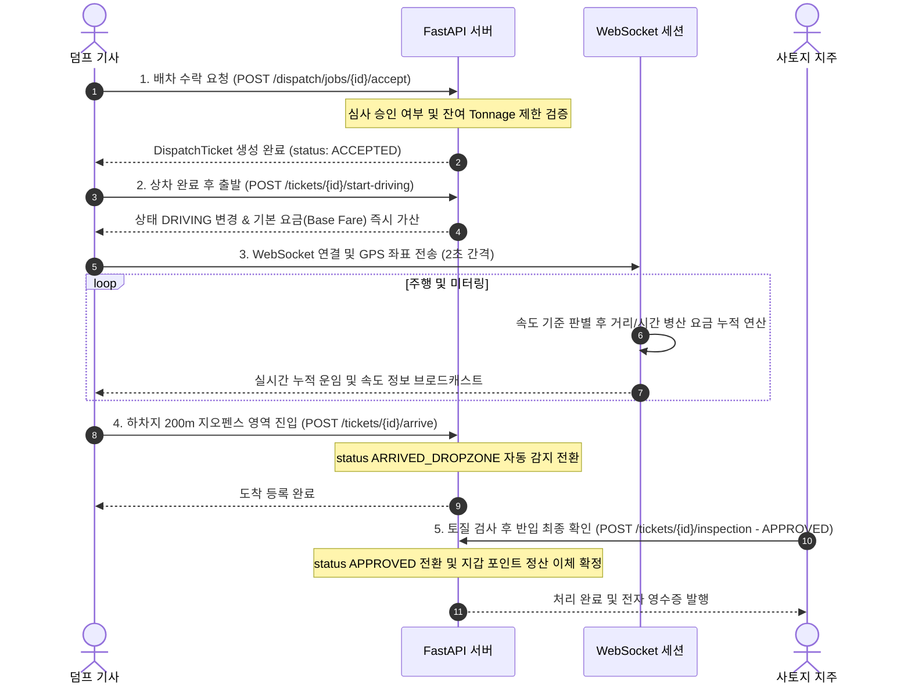

# 🏗️ 덤프링(DumpRing) 플랫폼 통합 개발 설계 및 소프트웨어 요구사항 명세서 (v2.0)

> 본 문서는 **덤프 트럭 배차 및 실시간 GPS 미터링 중개 플랫폼 "덤프링"** 백엔드 및 앱 시스템의 실제 구현 소스 코드(FastAPI, DB 스키마)와 신규 요구사항 명세(Next.js 14, TypeScript, Supabase, Capacitor, Portone 본인인증, 카카오내비 연동, 어드민 대시보드 및 복구 대책)를 융합하여 작성된 엔터프라이즈 레벨의 최종 소프트웨어 개발 명세서(SRS) 및 아키텍처 설계서입니다.

---

## 목차
1. [프로젝트 개요 및 애자일 스크럼 로드맵](#1-프로젝트-개요-및-애자일-스크럼-로드맵)
2. [소프트웨어 요구사항 명세 (SRS - IEEE 830 표준 기준)](#2-소프트웨어-요구사항-명세-srs---ieee-830-표준-기준)
3. [통합 데이터베이스 설계 (ERD & Data Dictionary)](#3-통합-데이터베이스-설계-erd--data-dictionary)
4. [시스템 아키텍처 및 실시간 통신 흐름 설계](#4-시스템-아키텍처-및-실시간-통신-흐름-설계)
5. [핵심 비즈니스 시퀀스 및 상태 전이도](#5-핵심-비즈니스-시퀀스-및-상태-전이도)
6. [상세 API 및 인터페이스 명세](#6-상세-api-및-인터페이스-명세)
7. [GPS 미터기 병산 요금 및 오차 보정 알고리즘](#7-gps-미터기-병산-요금-및-오차-보정-알고리즘)
8. [장애 대응 및 비정상 상황 장애 극복 방안 (Fault Tolerance)](#8-장애-대응-및-비정상-상황-장애-극복-방안-fault-tolerance)
9. [보안 및 데이터 접근 권한 설계 (RLS Policy)](#9-보안-및-데이터-접근-권한-설계-rls-policy)
10. [품질 검증 (QA) 및 E2E 테스트 계획서](#10-품질-검증-qa-및-e2e-테스트-계획서)

---

## 1. 프로젝트 개요 및 애자일 스크럼 로드맵

### 1-1. 서비스 비전 및 목표
덤프링(DumpRing)은 기존 수기 운반 전표 기반의 불투명한 정산 관행을 혁신하기 위해 **실시간 GPS 미터기 및 지오펜싱 도착 감지 기술**을 바탕으로 투명하고 정밀한 거래 증빙 및 운임 산정 서비스를 제공합니다. 상차지(공사현장)-덤프 차량 기사-하차지(사토장/성토 부지)를 유기적으로 중개하여 비효율적인 공차 운행률을 낮추고 배차 소요 시간을 대폭 감축하는 것을 목표로 합니다.

### 1-2. 사용자 역할 (Roles)
* **`ROLE_MANAGER` (현장 관리자)**: 공사 현장 등록, 상차 오더 발행, 소속 직원 승인/관리.
* **`ROLE_DROPZONE` (하차지 관리자/지주)**: 사토장 등록, 반입 한도 설정, 매립 수용 조건 등록, 반입 승인/반려.
* **`ROLE_DRIVER` (덤프 기사)**: 배차 콜 수락, 실시간 GPS 주행, 미터기 요금 정산 청구.
* **`ROLE_OWNER` (차주/운송사)**: 소속 차량 및 기사 선등록 매칭 관리, 기사별 차량 배정 및 정산 관리.
* **`ROLE_ADMIN` (플랫폼 관리자)**: 회원 서류 심사, 단가 및 수수료 관리, 분쟁 강제 중재 및 직권 정산 처리.

### 1-3. 스크럼 스프린트 로드맵
2주 단위 스크럼 스프린트 구조로 진행하며, Phase 1 MVP에서 작동 가능한 하이브리드 모바일 앱(Capacitor)과 백엔드(FastAPI / Supabase API)를 제공합니다.



---

## 2. 소프트웨어 요구사항 명세 (SRS - IEEE 830 표준 기준)

### 2-1. 기능적 요구사항 (FR)
* **[FR-01] 포트원 본인인증 연동**: 회원가입 시 중복 가입을 방지하기 위해 포트원(구 아임포트) SMS 인증 창을 연동하여 암호화 복호화된 개인 고유 CI 키를 데이터베이스 `users.ci` 필드에 기록합니다.
* **[FR-02] 다중 역할 통합 계정**: 사용자는 단일 계정으로 `is_driver`, `is_owner`, `is_site_manager` 등의 역할을 동시에 여러 개 가질 수 있는 유연한 권한 구조를 가집니다.
* **[FR-03] 차주 기사 선등록 매칭**: 차주(`is_owner=True`)가 기사 휴대폰 번호를 사전에 DB에 선등록해 두면, 해당 번호로 기사가 가입 완료하는 시점에 `drivers.user_id`를 가입 유저의 ID로 1:1 자동 매핑 처리합니다.
* **[FR-04] B2B 양방향 매칭 흐름**:
  * **흐름 A (하차지 우선)**: 하차지주가 수용 공고(`DropOffRequest`) 등록 ➔ 현장소장이 지정하여 매칭 요청 ➔ 하차지주가 검토 및 승인하여 `OPEN` 상태 전이.
  * **흐름 B (상차지 우선)**: 현장소장이 하차지 미정으로 모집 공고(`JobPost`) 등록 ➔ 사토지 지주가 매칭 요청 ➔ 현장소장이 최종 승인하여 `OPEN` 상태 전이.
* **[FR-05] 5분 타임아웃 배차 재발송**: 배차 요청 알림 발송 후 5분 이내에 기사가 수락하지 않을 시 `EXPIRED` 처리되고, 자동으로 반경 10km에서 20km로 수색 범위를 확장하여 가용 기사들에게 재발송합니다. 최대 3회 재발송 실패 시 "배차 실패" 알림을 제공합니다.
* **[FR-06] 실시간 GPS 병산 미터링**: 기사 앱에서 '운행 시작' 클릭 시 GPS 미터기가 작동하고, 속도 기준(10km/h 초과 시 거리 요금, 이하 시 시간 요금)에 맞추어 실시간으로 요금을 누적하여 저장합니다.
* **[FR-07] 자동 도착 감지 (지오펜싱)**: 기사의 GPS가 설정된 하차지 반경(기본 200m) 영역에 최초 진입 시, 단말 및 서버 측에서 감지하여 상태를 `ARRIVED_DROPZONE`으로 자동 전환합니다.
* **[FR-08] 직권 정산 및 분쟁 중재**: 하차지주가 부적합 토질 판정 등으로 `REJECTED` 처리할 시, 기사는 증빙 사진을 첨부하여 분쟁(`DISPUTED`) 조정을 접수할 수 있으며, 어드민은 GPS 궤적 로그 분석 결과에 근거하여 70% 직권 강제 정산(`SETTLE_ADJUSTED`)을 실행할 수 있습니다.

### 2-2. 비기능적 요구사항 (NFR)
* **[NFR-01] 성능 (Performance)**: GPS 위치 전송 및 실시간 미터기 응답 처리는 500ms 이내에 처리되어야 합니다.
* **[NFR-02] 가용성 (Availability)**: 덤프 트럭의 산간 운행 등 통신 음영구간에서 기기 오프라인 모드가 즉시 동작하여 로컬 저장 장치에 GPS 데이터가 유실 없이 버퍼링되어야 합니다.
* **[NFR-03] 데이터 암호화 (Security)**: 사용자 비밀번호는 `bcrypt` 해시 처리하고, 민감 정보(주민번호 대체 CI, 통장 계좌번호)는 백엔드 내부에서 `AES-256` 방식을 사용해 대칭키 암호화하여 DB에 보관합니다.

---

## 3. 통합 데이터베이스 설계 (ERD & Data Dictionary)

백엔드에서 동작하는 PostgreSQL / Supabase 테이블 명세 및 데이터 모델 관계도입니다.



### 3-1. 핵심 물리 테이블 상세 명세

#### ① `users` (통합 사용자)
```sql
CREATE TABLE users (
    id SERIAL PRIMARY KEY,
    ci VARCHAR(255) UNIQUE NULL,            -- 포트원 인증 고유 CI
    phone_number VARCHAR(50) UNIQUE NOT NULL, -- 로그인 ID 겸 전화번호
    password VARCHAR(255) NOT NULL,          -- bcrypt 암호화 해시
    name VARCHAR(100) NOT NULL,             -- 사용자 성명
    is_site_manager BOOLEAN NOT NULL DEFAULT false,
    is_site_worker BOOLEAN NOT NULL DEFAULT false,
    is_owner BOOLEAN NOT NULL DEFAULT false,
    is_driver BOOLEAN NOT NULL DEFAULT false,
    is_drop_off BOOLEAN NOT NULL DEFAULT false,
    is_admin BOOLEAN NOT NULL DEFAULT false,
    is_approved BOOLEAN NOT NULL DEFAULT false,     -- 어드민 승인 여부
    reject_reason TEXT NULL,
    created_at TIMESTAMP WITH TIME ZONE DEFAULT now() NOT NULL,
    updated_at TIMESTAMP WITH TIME ZONE DEFAULT now() NOT NULL
);
```

#### ② `job_posts` (B2B 양방향 매칭 오더)
```sql
CREATE TABLE job_posts (
    id SERIAL PRIMARY KEY,
    site_id INTEGER NOT NULL REFERENCES construction_sites(id) ON DELETE CASCADE,
    drop_off_request_id INTEGER NULL REFERENCES drop_off_requests(id) ON DELETE RESTRICT,
    author_id INTEGER NOT NULL REFERENCES users(id) ON DELETE CASCADE,
    material_type VARCHAR(50) NULL,           -- GOOD_SOIL, ROCK, MUD_SOIL, MIXED
    truck_type VARCHAR(50) NULL,              -- T_15, T_25, T_27
    offered_unit_price INTEGER NULL,          -- 운임 단가
    payer_type VARCHAR(50) NULL,              -- SITE_PAYS, DROP_OFF_PAYS, FREE
    matched_drop_off_id INTEGER NULL REFERENCES drop_offs(id) ON DELETE SET NULL,
    work_date TIMESTAMP WITH TIME ZONE NOT NULL,
    required_trucks INTEGER NOT NULL,
    status VARCHAR(50) NOT NULL DEFAULT 'WAITING_APPROVAL', -- WAITING_MATCH, WAITING_APPROVAL, OPEN, COMPLETED, CANCELLED
    created_at TIMESTAMP WITH TIME ZONE DEFAULT now() NOT NULL,
    updated_at TIMESTAMP WITH TIME ZONE DEFAULT now() NOT NULL
);
```

#### ③ `dispatch_tickets` (배차 및 미터기 정산 티켓)
```sql
CREATE TABLE dispatch_tickets (
    id SERIAL PRIMARY KEY,
    job_post_id INTEGER NOT NULL REFERENCES job_posts(id) ON DELETE CASCADE,
    driver_id INTEGER NOT NULL REFERENCES users(id) ON DELETE RESTRICT,
    car_id INTEGER NOT NULL REFERENCES cars(id) ON DELETE RESTRICT,
    status VARCHAR(50) NOT NULL DEFAULT 'ACCEPTED', -- ACCEPTED, DRIVING, ARRIVED, APPROVED, REJECTED, CANCELLED, DISPUTED, SETTLE_ADJUSTED
    accumulated_fare INTEGER NOT NULL DEFAULT 0,
    drive_distance_km DOUBLE PRECISION NOT NULL DEFAULT 0.0,
    drive_time_seconds INTEGER NOT NULL DEFAULT 0,
    accepted_at TIMESTAMP WITH TIME ZONE DEFAULT now() NOT NULL,
    driving_started_at TIMESTAMP WITH TIME ZONE NULL,
    arrived_at TIMESTAMP WITH TIME ZONE NULL,
    completed_at TIMESTAMP WITH TIME ZONE NULL
);
```

#### ④ `gps_tracks` (GPS 상세 운행 궤적)
```sql
CREATE TABLE gps_tracks (
    id BIGSERIAL PRIMARY KEY,
    ticket_id INTEGER NOT NULL REFERENCES dispatch_tickets(id) ON DELETE CASCADE,
    latitude DOUBLE PRECISION NOT NULL,
    longitude DOUBLE PRECISION NOT NULL,
    speed_kmh DOUBLE PRECISION NOT NULL,
    fare_mode VARCHAR(30) NOT NULL,          -- DISTANCE_MODE, TIME_MODE, STOPPED
    incremental_fare INTEGER NOT NULL DEFAULT 0,
    is_valid BOOLEAN NOT NULL DEFAULT true,  -- 순간이동 보정용 필터
    recorded_at TIMESTAMP WITH TIME ZONE NOT NULL
);
CREATE INDEX idx_gps_tracks_ticket_time ON gps_tracks(ticket_id, recorded_at);
```

#### ⑤ `wallets` (가상 지갑 잔고)
```sql
CREATE TABLE wallets (
    id SERIAL PRIMARY KEY,
    user_id INTEGER NOT NULL UNIQUE REFERENCES users(id) ON DELETE CASCADE,
    balance INTEGER NOT NULL DEFAULT 0,
    updated_at TIMESTAMP WITH TIME ZONE DEFAULT now() NOT NULL
);
```

---

## 4. 시스템 아키텍처 및 실시간 통신 흐름 설계

Next.js 14 풀스택 및 FastAPI 백엔드가 Supabase 실시간 인프라 및 단말 게이트와 연결되는 물리 설계 구도입니다.

```
┌────────────────────────────────────────────────────────────────┐
│                   App & Web Clients (Capacitor)                │
│                                                                │
│ [기사 앱]                      [현장소장 웹]       [지주 앱]    │
│  - Wake Lock 제어              - 실시간 대시보드   - 반입승인   │
│  - SQLite 로컬 버퍼링          - 오더 생성         - 200m 지오펜스│
└───────────────────────────────┬────────────────────────────────┘
                                │ HTTP API / WebSockets
                                ▼
┌────────────────────────────────────────────────────────────────┐
│                   Platform Application Layer                   │
│                                                                │
│  Next.js 14 API Gateway        FastAPI Async Services          │
│   - Portone 본인인증 중계      - WebSocket 실시간 관제         │
│   - JWT / RLS 권한 검증        - GPS Haversine 연산엔진        │
└───────────────────────────────┬────────────────────────────────┘
                                │ ORM (SQLAlchemy) / Realtime SDK
                                ▼
┌────────────────────────────────────────────────────────────────┐
│                       Data Storage Layer                       │
│                                                                │
│  Supabase Realtime Engine      PostgreSQL Database Instance    │
│   - 기사 위치 구독 변경 브로드  - WAL Archiving 백업            │
│   - 상태 변동 이벤트 전파       - RLS Row 보안 필터             │
└────────────────────────────────────────────────────────────────┘
```

---

## 5. 핵심 비즈니스 시퀀스 및 상태 전이도

### 5-1. B2B 오더 매칭 상태 머신 (JobPost Lifecycle)


### 5-2. 배차 콜 수락 및 실시간 운임 누적 운행 시퀀스
기사가 배차 콜을 수락한 시점부터 하차지 도착 승인까지의 실시간 트랜잭션 흐름도입니다.



---

## 6. 상세 API 및 인터페이스 명세

### 6-1. [FR-01] 본인인증 검증 완료 및 정보 갱신 API
* **Method / Endpoint**: `POST /api/auth/verify-identity`
* **Request Header**: `Content-Type: application/json`
* **Request Body**:
  ```json
  {
    "enc_data": "dGhlc2UgYXJlIGV4YW1wbGUgZW5jcnlwdGVkIGRhdGE=",
    "integrity_token": "token_integrity_verification_string"
  }
  ```
* **Response (200 OK)**:
  ```json
  {
    "success": true,
    "data": {
      "name": "김철수",
      "phone_number": "01056781234",
      "ci": "KCB_CI_KEY_d34b2a88e99cf4a...",
      "birthday": "1984-05-12"
    }
  }
  ```

### 6-2. [FR-05] 오프라인 버퍼링 GPS 좌표 벌크 동기화 API
* **Method / Endpoint**: `POST /api/dispatch/tickets/{ticket_id}/bulk-sync`
* **Request Header**: `Authorization: Bearer <JWT_ACCESS_TOKEN>`
* **Request Body**:
  ```json
  {
    "gps_logs": [
      { "latitude": 37.4979, "longitude": 127.0276, "timestamp": "2026-06-12T01:05:00Z", "speed_kmh": 45.5 },
      { "latitude": 37.4991, "longitude": 127.0288, "timestamp": "2026-06-12T01:05:10Z", "speed_kmh": 48.0 },
      { "latitude": 37.5012, "longitude": 127.0312, "timestamp": "2026-06-12T01:05:20Z", "speed_kmh": 0.0 }
    ]
  }
  ```
* **Response (200 OK)**:
  ```json
  {
    "processed_count": 3,
    "calculated_fare_delta": 3400,
    "total_accumulated_fare": 48400,
    "message": "오프라인 로컬 캐시 좌표 배치 동기화 성공"
  }
  ```

### 6-3. [FR-08] 어드민 분쟁 중재 직권 조정 정산 API
* **Method / Endpoint**: `POST /api/dispatch/admin/tickets/{ticket_id}/force-settle`
* **Request Header**: `Authorization: Bearer <ADMIN_JWT_TOKEN>`
* **Request Body**:
  ```json
  {
    "reason": "하차지 뻘흙 반입 반려 건에 대한 기사 GPS 운행 궤적 확인 및 70% 직권 정산 처리 실행",
    "adjusted_percentage": 70
  }
  ```
* **Response (200 OK)**:
  ```json
  {
    "ticket_id": 105,
    "original_fare": 80000,
    "adjusted_fare": 56000,
    "status": "SETTLE_ADJUSTED",
    "transferred_at": "2026-06-12T01:45:00Z"
  }
  ```

---

## 7. GPS 미터기 병산 요금 및 오차 보정 알고리즘

### 7-1. 거리/시간 병산 요금 연산 (FareCalculator)
덤프 트럭의 실시간 상태 속도에 따라 요금 누적 공식이 병산 적용됩니다.

$$\text{Total\_Fare} = \text{Base\_Fare} + \sum \Delta \text{Distance\_Fare} + \sum \Delta \text{Time\_Fare}$$

* **기본요금 (Base Fare)**: 운행 시작 즉시 톤수별 고정 이체금 적재.
* **거리 모드 (DISTANCE_MODE)**: 속도가 10km/h를 초과하는 구간.
  $$\Delta \text{Distance\_Fare} = \frac{\text{주행거리}(m)}{1000} \times \text{km당 단가}$$
* **시간 모드 (TIME_MODE)**: 속도가 10km/h 이하인 상차/하차 대기 및 도로 정체 구간.
  $$\Delta \text{Time\_Fare} = \frac{\text{경과시간}(sec)}{60} \times \text{분당 단가}$$

### 7-2. GPS 오차 데이터 노이즈 필터링 정책
1. **순간이동 감지 (Outlier Detection)**: 이전 정상 수집 좌표와 현재 수집된 좌표 간의 이동 거리가 5초 이내에 500m를 초과(시속 360km/h 초과에 대응)할 경우 해당 포인트 수집을 거부 처리하고 이전 좌표로 유지 보간합니다 (`is_valid = false`).
2. **네비 연동 경로 맵 매칭 (Map Matching)**: 터널이나 교량 등 GPS 음영 지역 통과 후 좌표가 튈 때, 수집된 시작점과 끝점 좌표를 카카오 내비 Directions API에 전달하여 실제 도로 경로(Polyline)와의 거리 오차를 맵 매칭하여 정밀 주행거리를 도출합니다.

---

## 8. 장애 대응 및 비정상 상황 장애 극복 방안 (Fault Tolerance)

### 8-1. 운행 중 기사 스마트폰 하드웨어 고장 대응
* **문제 상황**: 주행 도중 기사의 스마트폰 파손, 침수, 방전 등으로 미터기 및 도착 신호 송출이 불가한 상태.
* **장애 극복 절차**:
  1. 기사가 하차지에 도달한 후 사토장 지주(Landowner)에게 차량 번호를 구두로 전달합니다.
  2. 지주는 본인의 모바일/웹 콘솔 화면에서 `차량번호로 진행 중인 티켓 검색`을 실행합니다.
  3. 일치하는 배차 티켓 정보를 조회한 후, `[기기 고장 대리 도착 승인]` 버튼을 작동합니다.
  4. 서버는 해당 티켓의 최종 요금을 해당 상차지-하차지 구간의 사전 확정된 기본 약정 단가(Flat Rate)로 대체 설정한 후 `COMPLETED`로 변경하여 강제 정산을 실행합니다.

### 8-2. 장기 통신 장애 시 앱 내 오프라인 SQLite 버퍼링 정책
* **문제 상황**: 지하 공사장 내부 또는 LTE 망 음영 지역에서 지속적으로 통신 장애 발생.
* **장애 극복 절차**:
  1. 기사 앱 내 GPS 수집기가 API 전송에 3회 실패할 경우 즉시 기기 `Offline Local Buffering Mode`를 개시합니다.
  2. 수집되는 GPS 위경도, 속도, 타임스탬프 정보를 모바일 내장 경량 DB(SQLite)에 순차적으로 로컬 캐싱 처리합니다.
  3. 통신이 감지되면 앱의 백그라운드 매니저가 API `/api/dispatch/tickets/{ticket_id}/bulk-sync`를 호출하여 캐시된 데이터를 배치 전송(Batch Sync)합니다.
  4. 서버는 타임스탬프 순서대로 유효성 필터링을 재검토하여 누락된 정산 요금을 소급 적재합니다.

### 8-3. 데이터 백업 및 시점 복구(PITR) 전략
* **데이터 백업**: Supabase Cloud 인프라의 WAL(Write-Ahead Logging) 아카이빙을 활용하여 5분 단위로 변경분 백업을 수행하며, 매일 새벽 4시 물리적 전체 백업본을 별도 암호화 보관합니다.
* **재해 복구**: 정산 데이터의 논리 오류 또는 관리자 조작 실수 발생 시, WAL 로그를 장애 시점 1초 전(`2026-04-12 10:00:00 KST`)으로 추적 지정해 복제 DB 인스턴스를 구축하고 커넥션 스트링을 롤오버 교체합니다.

---

## 9. 보안 및 데이터 접근 권한 설계 (RLS Policy)

데이터베이스의 다중 접근 제한을 설계하기 위해 PostgreSQL 레벨의 Row Level Security(RLS) 정책을 정의합니다.

* **[RLS-01] `construction_sites` (현장) 권한**:
  ```sql
  CREATE POLICY site_access_policy ON construction_sites 
  FOR ALL TO authenticated
  USING (user_id = auth.uid() OR EXISTS (
      SELECT 1 FROM site_user_mappings 
      WHERE site_id = id AND user_id = auth.uid() AND status = 'APPROVED'
  ));
  ```
* **[RLS-02] `gps_tracks` (GPS 데이터) 권한**:
  기사 본인의 데이터이거나 플랫폼 분쟁 중재가 필요한 경우(`ROLE_ADMIN`)만 읽기를 허용합니다.
  ```sql
  CREATE POLICY gps_track_policy ON gps_tracks
  FOR ALL TO authenticated
  USING (
      EXISTS (
          SELECT 1 FROM dispatch_tickets 
          WHERE id = gps_tracks.ticket_id AND (driver_id = auth.uid() OR auth.jwt() ->> 'role' = 'ROLE_ADMIN')
      )
  );
  ```

---

## 10. 품질 검증 (QA) 및 E2E 테스트 계획서

### 10-1. 단위 테스트 (Vitest/Jest) 케이스 목록
* **FareCalculator 단위 테스트**:
  - `DISTANCE_MODE`에 부합하는 GPS 포인트 전송 시 시간 요금 유실 여부 검증.
  - 10km/h 이하 `TIME_MODE` 전환 시 누적 요금이 분당 단가에 맞춰 정확하게 연산되는가 검증.
* **선등록 매칭 기능 테스트**:
  - 가입 이전 `registered_phone`으로 임의 기사 레코드가 추가된 상태에서, 동일 번호 가입 시 `drivers.user_id` 매핑 관계 자동 갱신 검증.

### 10-2. E2E 통합 테스트 (Playwright) 시나리오

#### [TC-E2E-01] 상상지 ➔ 하차지 양방향 매칭 및 이송 완료 E2E 흐름
1. **사전 준비**: 테스트 기사, 테스트 소장, 테스트 지주 계정 생성 및 본인인증 승인 상태 부여.
2. **배차 오더 생성**: 소장이 `POST /api/jobs/site-post` 호출하여 매칭 대기 중인 오더 생성.
3. **매칭 요청**: 지주가 `PATCH /api/jobs/{id}/match` 호출하여 사토장 정보 연결 및 대기 전환.
4. **승인 및 배차 수락**: 소장이 매칭 확정 승인하여 `OPEN` 처리 후, 기사가 `POST /api/dispatch/jobs/{id}/accept` 호출해 수락 티켓 생성.
5. **GPS 운행 시작**: 기사가 운행 시작 요청 후, WebSocket을 통해 목적지 근방(지오펜싱 경계 안) 위경도 좌표 전송.
6. **도착 및 반입 승인**: 상태가 `ARRIVED_DROPZONE`으로 자동 갱신된 것을 확인한 지주 계정이 `APPROVED` 반입 확인 완료 처리.
7. **정산 검증**: 기사와 지주의 가상 지갑 포인트 잔고가 최종 정산 단가만큼 정상 증감 및 마감 완료되었는지 검토.
