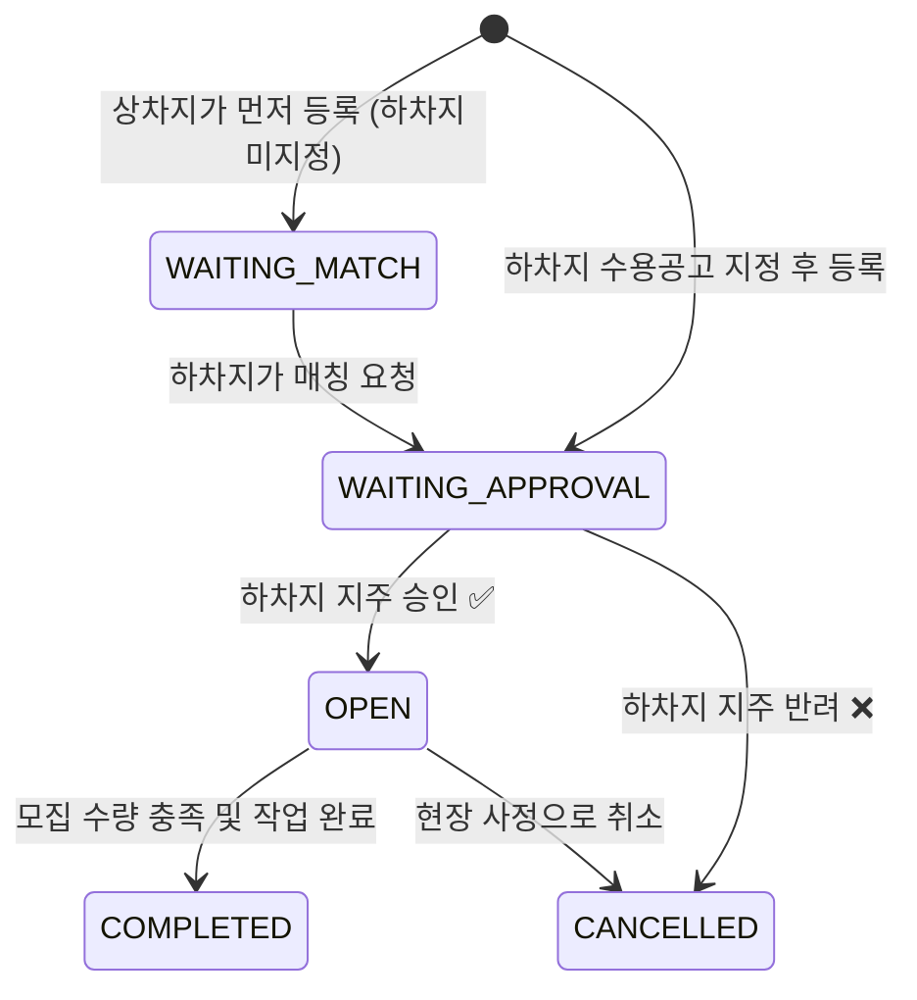
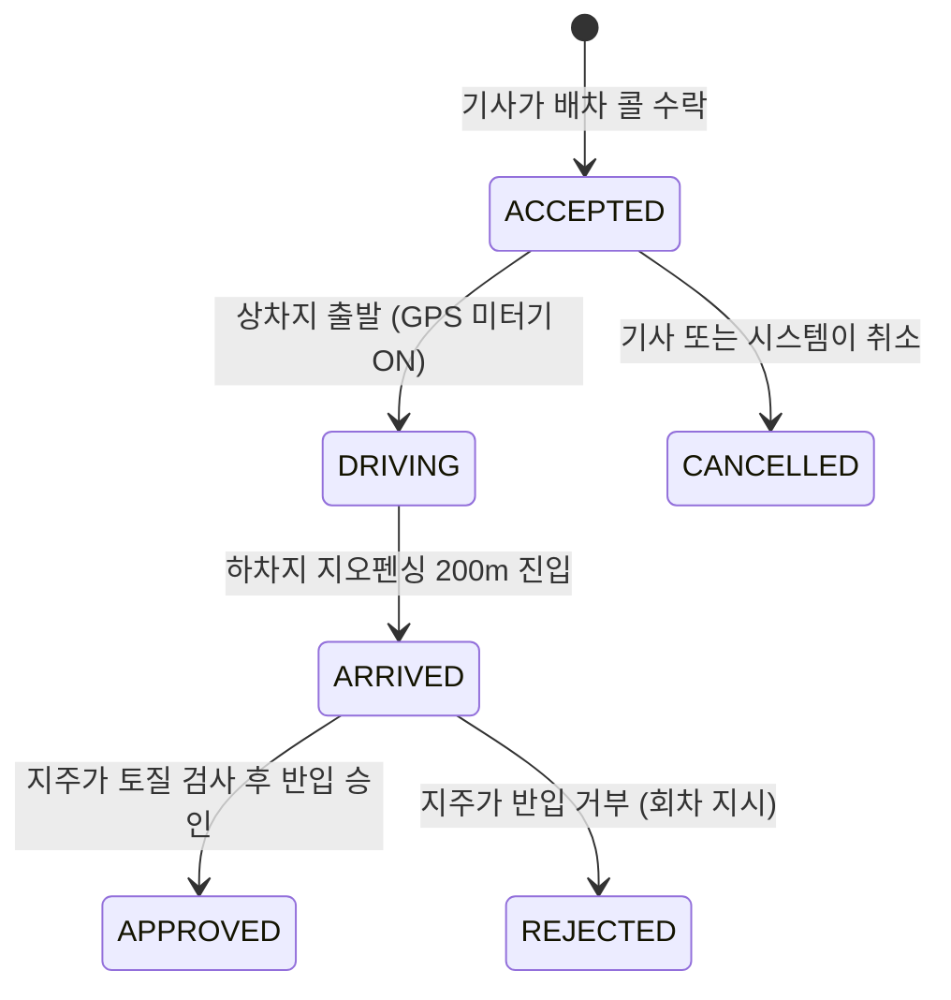

# 📖 덤프링(Dumpring) 프로젝트 — 용어 & 코드 사전

> 덤프 트럭 배차·운송 중개 플랫폼 **"덤프링"** 프로젝트에서 사용하는 모든 비즈니스 용어, 코드 구조, 상태값을 정리한 종합 사전입니다.

---

## 1. 🏗️ 비즈니스 도메인 용어

### 현장 & 물류 용어

| 한글 용어 | 영문 / 코드명 | 설명 |
| :--- | :--- | :--- |
| **상차지** | Loading Site | 덤프 트럭이 **흙을 싣는 장소** (= 공사현장). 굴삭기가 흙을 퍼서 덤프에 적재하는 곳 |
| **하차지** | Unloading Site / Drop-Off | 덤프 트럭이 **흙을 내려놓는 장소** (= 사토장). 땅 주인(지주)이 운영 |
| **사토장** | Drop-Off Site | 하차지와 동의어. 건설 현장에서 발생한 토사를 합법적으로 매립하는 땅 |
| **토사 / 사토** | Material / Soil | 건설 현장에서 발생하는 흙·돌·진흙 등의 총칭 |
| **토종** | Material Type | 토사의 세부 종류 (양질토, 뻘흙, 암버럭, 혼합토) |
| **양질토** | `GOOD_SOIL` | 도로·성토용에 가장 적합한 양질의 흙 |
| **뻘흙** | `MUD_SOIL` | 점성이 강한 흙. 하차지 반입 시 정밀 검사 필요 |
| **암버럭** | `ROCK` | 발파·굴착 시 나오는 돌덩어리 및 암석 |
| **혼합토** | `MIXED` | 흙과 암석이 혼재된 복합 토사 |
| **오더** | Order / JobPost | 덤프 기사를 모집하는 **배차 요청 공고** |
| **배차** | Dispatch | 특정 오더에 기사를 배정하는 행위 |
| **배차 티켓** | Dispatch Ticket | 기사 1명의 1회 운행에 대한 GPS 미터링·정산 단위 |
| **콜** | Call | 기사가 수락하는 배차 요청 알림 |
| **미터기** | Fare Meter | 실시간 GPS 기반 택시미터기식 운임 산정 시스템 |
| **지오펜싱** | Geofencing | GPS 좌표 기반으로 특정 반경(기본 200m) 안에 진입했는지 감지하는 기술 |
| **회차** | Return / Rejection | 하차지에서 토사 부적합 판정으로 반입 거부되어 되돌아가는 것 |
| **세륜기** | Washing Facility | 현장 출입 시 바퀴의 흙을 씻어내는 장비 |
| **선등록** | Pre-registration | 관리자(소장/차주)가 직원/기사의 휴대폰 번호만 미리 등록해두는 방식 |
| **매칭** | Matching | 상차지(공사현장)와 하차지(사토장)를 연결하는 B2B 중개 행위 |
| **수용 공고** | Drop-Off Request | 하차지 지주가 "이런 종류의 흙을 받겠다"고 올리는 매립 수용 게시글 |

---

### 사람(역할) 용어

| 한글 용어 | 영문 / 코드명 | DB 필드 | 설명 |
| :--- | :--- | :--- | :--- |
| **현장 관리자** (소장/경리) | Site Manager | `is_site_manager` | 공사현장을 개설하고 오더를 발행하는 책임자 |
| **현장 담당자** | Site Worker | `is_site_worker` | 현장 출입 통제 및 도장(서명) 업무를 수행하는 실무 직원 |
| **차주** (사장님) | Owner | `is_owner` | 덤프 트럭을 소유하고 기사를 고용·관리하는 사업자 |
| **기사** (운전기사) | Driver | `is_driver` | 실제 덤프 트럭을 운전하여 흙을 운반하는 기사 |
| **하차지 지주** (땅 주인) | Drop-Off Owner | `is_drop_off` | 사토장(하차지) 땅을 소유하고 토사 반입을 관리하는 지주 |
| **플랫폼 관리자** (어드민) | Admin | `is_admin` | 시스템 전반을 총괄하는 최고 관리자 (회원 심사, 분쟁 중재) |

> [!NOTE]
> **통합 계정 구조**: 한 사용자 계정이 위 6가지 역할을 **동시에 여러 개** 가질 수 있습니다 (Boolean 토글 방식).
> 예) 차주 사장님이 직접 운전도 하는 경우 → `is_owner=True` + `is_driver=True`

---

## 2. 🗄️ 데이터베이스 테이블 (Models) 요약

프로젝트의 DB 모델은 [models.py](file:///D:/Projects/dumpring/dumpring-platform-backend/app/models.py)에 정의되어 있습니다.

| # | 테이블명 | 클래스명 | 한글 명칭 | 핵심 역할 |
| :---: | :--- | :--- | :--- | :--- |
| 1 | `users` | [User](file:///D:/Projects/dumpring/dumpring-platform-backend/app/models.py#L9-L48) | 통합 계정 | 본인인증(CI) 기반의 다중 역할 통합 계정 |
| 2 | `construction_sites` | [ConstructionSite](file:///D:/Projects/dumpring/dumpring-platform-backend/app/models.py#L51-L75) | 공사현장 | 건설사 정보, 현장 좌표, 지오펜싱 반경 관리 |
| 3 | `site_employees` | [SiteEmployee](file:///D:/Projects/dumpring/dumpring-platform-backend/app/models.py#L78-L97) | 현장 소속 직원 | 소장이 번호로 선등록 → 가입 시 자동 연동 |
| 4 | `unloading_sites` | [UnloadingSite](file:///D:/Projects/dumpring/dumpring-platform-backend/app/models.py#L100-L119) | 하차지 (사토장) | 수용 가능 토종 정보 포함 |
| 5 | `cars` | [Car](file:///D:/Projects/dumpring/dumpring-platform-backend/app/models.py#L122-L139) | 차량 | 차량번호, 톤수 정보 |
| 6 | `drivers` | [Driver](file:///D:/Projects/dumpring/dumpring-platform-backend/app/models.py#L142-L162) | 기사 | 차주가 선등록 → 기사 가입 시 연동 + 차량 배정 |
| 7 | `user_uploaded_documents` | [UserUploadedDocument](file:///D:/Projects/dumpring/dumpring-platform-backend/app/models.py#L165-L180) | 필수 서류 | 가입 심사용 첨부 서류 관리 |
| 8 | `orders` | [Order](file:///D:/Projects/dumpring/dumpring-platform-backend/app/models.py#L183-L223) | 오더 (구버전) | 상·하차지 중계 기사 모집 (레거시) |
| 9 | `site_profiles` | [SiteProfile](file:///D:/Projects/dumpring/dumpring-platform-backend/app/models.py#L226-L243) | 현장 프로필 | 현장관리자/담당자의 회사·현장 세부 정보 |
| 10 | `drop_off_profiles` | [DropOffProfile](file:///D:/Projects/dumpring/dumpring-platform-backend/app/models.py#L246-L263) | 하차지 프로필 | 지주의 허가증 번호, 주소 등 상세 정보 |
| 11 | `site_user_mappings` | [SiteUserMapping](file:///D:/Projects/dumpring/dumpring-platform-backend/app/models.py#L272-L286) | 현장-유저 매핑 | 현장과 유저 간 다대다(N:N) 소속 관계 + 승인 심사 |
| 12 | `common_codes` | [CommonCode](file:///D:/Projects/dumpring/dumpring-platform-backend/app/models.py#L313-L331) | 공통 코드 | 토사종류, 트럭규격, 정산방식 등 동적 마스터 코드 |
| 13 | `drop_offs` | [DropOff](file:///D:/Projects/dumpring/dumpring-platform-backend/app/models.py#L334-L355) | 하차지 마스터 | 지주가 개설한 하차지 기본 정보 (좌표, 반경, 허가번호) |
| 14 | `drop_off_requests` | [DropOffRequest](file:///D:/Projects/dumpring/dumpring-platform-backend/app/models.py#L358-L397) | 매립 수용 공고 | 하차지 지주가 올리는 토사 수용 조건 공고 |
| 15 | `job_posts` | [JobPost](file:///D:/Projects/dumpring/dumpring-platform-backend/app/models.py#L401-L447) | 모집 오더 | B2B 양방향 매칭 지원 핵심 오더 테이블 |
| 16 | `driver_favorite_regions` | [DriverFavoriteRegion](file:///D:/Projects/dumpring/dumpring-platform-backend/app/models.py#L450-L464) | 기사 선호 지역 | 시/도, 시/군/구 단위 선호 배차 지역 |
| 17 | `dispatch_tickets` | [DispatchTicket](file:///D:/Projects/dumpring/dumpring-platform-backend/app/models.py#L467-L488) | 배차 티켓 | 기사 1회 운행의 GPS 미터링 + 정산 단위 |
| 18 | `sdui_themes` | [SduiTheme](file:///D:/Projects/dumpring/dumpring-platform-backend/app/models.py#L493-L515) | SDUI 테마 | 앱 UI 테마를 DB에서 동적 관리 |

---

## 3. 🔄 상태 코드 (Status) 상세

### 3-1. B2B 오더(JobPost) 상태 머신



| 상태 코드 | 한글 명칭 | 설명 |
| :--- | :--- | :--- |
| `WAITING_MATCH` | 하차지 매칭 대기 | 상차지가 먼저 올림 → 아직 하차지가 정해지지 않은 상태 |
| `WAITING_APPROVAL` | 하차지 승인 대기 | 하차지를 지정했지만, 지주의 최종 승인을 기다리는 상태 |
| `OPEN` | 모집 중 | 지주 승인 완료 → 기사 앱에 배차 공고 노출 |
| `COMPLETED` | 완료 | 모집 수량 충족 및 작업이 모두 끝난 상태 |
| `CANCELLED` | 취소 | 현장 사정 또는 지주 반려로 오더가 폐기된 상태 |

---

### 3-2. 배차 티켓(DispatchTicket) 상태 흐름



| 상태 코드 | 한글 명칭 | 설명 |
| :--- | :--- | :--- |
| `ACCEPTED` | 수락 | 기사가 배차 콜을 수락한 초기 상태 |
| `DRIVING` | 운행 중 | GPS 미터기 작동 중 (거리·시간·운임 실시간 계산) |
| `ARRIVED` | 도착 | 하차지 반경 200m 이내 진입 감지 |
| `APPROVED` | 승인 완료 | 지주가 토질 검사 후 정상 반입 승인 → 정산 트리거 |
| `REJECTED` | 반려 (회차) | 토사 부적합 판정으로 반입 거부 → 분쟁 조정 가능 |
| `CANCELLED` | 취소 | 운행이 취소된 상태 |

---

### 3-3. 현장-유저 매핑(SiteUserMapping) 심사 상태

| 상태 코드 | 한글 명칭 | 설명 |
| :--- | :--- | :--- |
| `PENDING` | 승인 대기 | 담당자가 현장 소속 신청 후 소장의 심사를 기다리는 상태 |
| `APPROVED` | 승인 완료 | 소장이 승인 → 현장 통제 권한 획득 |
| `REJECTED` | 거절됨 | 소속 정보 불일치 등으로 거부 처리 |

---

### 3-4. 구버전 오더(Order) 상태 코드

| 상태 코드 | 한글 명칭 |
| :--- | :--- |
| `PENDING_APPROVAL` | 하차지 승인 대기 |
| `RECRUITING` | 기사 모집 중 |
| `ACTIVE` | 주행·배차 진행 중 |
| `COMPLETED` | 완료 |
| `CANCELLED` | 취소 |

---

## 4. 📊 공통 코드표 (CommonCode 그룹별)

DB의 `common_codes` 테이블에서 `group_code`로 분류되는 동적 마스터 코드입니다.

### ① 토사 종류 (`MATERIAL_TYPE`)
| 코드 | 한글명 | 설명 |
| :--- | :--- | :--- |
| `GOOD_SOIL` | 양질토 | 도로·성토용 양질의 흙 |
| `MUD_SOIL` | 뻘흙 | 점성 강한 흙, 정밀 검사 필요 |
| `ROCK` | 암버럭 | 발파·굴착 시 발생하는 돌 |
| `MIXED` | 혼합토 | 흙+암석 혼재 |

### ② 덤프 트럭 규격 (`TRUCK_TYPE`)
| 코드 | 한글명 | 톤수 |
| :--- | :--- | :--- |
| `T_15` | 15톤 덤프 | 15.0톤 — 도심 좁은 도로용 |
| `T_25` | 25톤 덤프 | 25.5톤 — 장거리 메인 덤프 |
| `T_27` | 27톤 덤프 | 27.0톤 — 초고용량 특수 차량 |

### ③ 지불 주체 (`PAYER_TYPE`)
| 코드 | 한글명 | 설명 |
| :--- | :--- | :--- |
| `SITE_PAYS` | 현장 지불 | 공사현장(상차지)이 운송비 부담 |
| `DROP_OFF_PAYS` | 하차지 지불 | 사토장 지주가 비용 부담 |
| `FREE` | 무상 | 운송비 거래 없음 |

### ④ 정산 방식 (`PAYMENT_METHOD`)
| 코드 | 한글명 | 설명 |
| :--- | :--- | :--- |
| `DAILY` | 당일 지급 | 운행 완료 즉시 기사 지갑으로 정산 |
| `MONTHLY` | 월대 (월말 정산) | 월 단위 마감 후 세금계산서 발행·일괄 정산 |

---

## 5. 🌐 백엔드 API 모듈 구조

[app/api/](file:///D:/Projects/dumpring/dumpring-platform-backend/app/api) 디렉토리의 라우터 구성입니다.

| 모듈 파일 | 담당 영역 | 주요 기능 |
| :--- | :--- | :--- |
| [auth.py](file:///D:/Projects/dumpring/dumpring-platform-backend/app/api/auth.py) | 인증·회원 | 회원가입, 로그인, 본인인증, 가입 심사, 역할별 프로필 관리 |
| [site_mgmt.py](file:///D:/Projects/dumpring/dumpring-platform-backend/app/api/site_mgmt.py) | 현장 관리 | 공사현장 CRUD, 직원 선등록, 소속 매핑 승인/반려 |
| [jobs.py](file:///D:/Projects/dumpring/dumpring-platform-backend/app/api/jobs.py) | 오더·모집 | B2B 매칭 오더 발행, 하차지 승인, 상태 전이 관리 |
| [drop_offs.py](file:///D:/Projects/dumpring/dumpring-platform-backend/app/api/drop_offs.py) | 하차지 | 하차지 개설, 수용 공고(DropOffRequest) 등록·관리 |
| [dispatch.py](file:///D:/Projects/dumpring/dumpring-platform-backend/app/api/dispatch.py) | 배차·운행 | 배차 티켓 생성, GPS 미터기 운행, 도착·승인·회차 처리 |
| [fleet.py](file:///D:/Projects/dumpring/dumpring-platform-backend/app/api/fleet.py) | 차량·기사 | 차량 등록, 기사 선등록·연동, 차량 배정 |
| [owner.py](file:///D:/Projects/dumpring/dumpring-platform-backend/app/api/owner.py) | 차주 | 차주 소속 기사 목록, 차량·기사 관리 |
| [locations.py](file:///D:/Projects/dumpring/dumpring-platform-backend/app/api/locations.py) | 위치·지역 | GPS 좌표 관련 기능, 기사 선호 지역 설정 |
| [common_codes.py](file:///D:/Projects/dumpring/dumpring-platform-backend/app/api/common_codes.py) | 공통 코드 | 마스터 코드 CRUD (토사종류, 트럭규격 등) |
| [sdui.py](file:///D:/Projects/dumpring/dumpring-platform-backend/app/api/sdui.py) | SDUI 테마 | 앱 UI 테마 동적 관리 (색상, 폰트 등) |

---

## 6. 🔑 기술 용어 & 설계 패턴

| 용어 | 설명 |
| :--- | :--- |
| **CI (본인인증 키)** | 휴대폰 본인인증 시 발급되는 개인 고유 식별값. 중복 가입 방지용 |
| **선등록 매칭 구조** | 관리자가 폰 번호만 미리 등록 → 해당 번호의 사용자가 가입하면 자동 연동 |
| **B2B 양방향 매칭** | 흐름 A(하차지 먼저): 하차지 공고 → 상차지 오더 신청. 흐름 B(상차지 먼저): 상차지 공고 → 하차지 매칭 요청 |
| **하이브리드 공통 코드** | DB에 Enum 상수와 동적 CommonCode 테이블을 병행하여 유연성과 타입 안전성을 동시에 확보하는 설계 |
| **GPS 택시미터기** | 상차지→하차지 실시간 주행 거리·시간을 GPS로 측정하여 운임을 산정하는 시스템 |
| **지오펜싱 게이트** | 하차지 중심 좌표 기준 반경 200m 이내 진입 시 자동으로 도착 이벤트를 발생시키는 GPS 울타리 |
| **직권 정산 (SETTLE_ADJUSTED)** | 분쟁 발생 시 어드민이 GPS 궤적을 분석하여 운임의 70%를 강제 정산하는 중재 조치 |
| **SDUI (Server-Driven UI)** | 앱의 UI 테마(색상, 폰트 등)를 서버 DB에서 관리하여 앱 업데이트 없이 실시간으로 변경 가능한 구조 |
| **Alembic** | SQLAlchemy 기반 DB 마이그레이션 도구. 테이블 스키마 변경 이력을 관리 |
| **FastAPI** | Python 기반 비동기 웹 프레임워크. 덤프링 백엔드의 핵심 프레임워크 |
| **Pydantic Schema** | API 요청/응답 데이터의 유효성 검증 및 직렬화를 담당하는 데이터 모델 |

---

## 7. 📁 프로젝트 전체 구조

```
D:\Projects\dumpring\
├── 📂 dumpring-home/                    # 홈페이지 (프론트엔드)
│   ├── index.html                        # 메인 랜딩 페이지
│   ├── css/                              # 스타일시트
│   └── js/                               # 클라이언트 스크립트
│
├── 📂 dumpring-platform-backend/        # 플랫폼 백엔드 (FastAPI)
│   ├── app/
│   │   ├── main.py                       # FastAPI 앱 진입점
│   │   ├── models.py                     # SQLAlchemy DB 모델 (전체 테이블 정의)
│   │   ├── api/                          # API 라우터 모듈들
│   │   ├── schemas/                      # Pydantic 요청/응답 스키마
│   │   ├── core/                         # 핵심 설정 (DB, 인증 등)
│   │   └── templates/                    # HTML 템플릿
│   ├── alembic/                          # DB 마이그레이션
│   ├── docs/                             # 기술 문서
│   ├── dumpring_app/                     # 모바일 앱 관련
│   ├── dumpring_web/                     # 웹 프론트 관련
│   ├── lib/                              # 공유 라이브러리
│   ├── requirements.txt                  # Python 패키지 의존성
│   ├── render.yaml                       # Render.com 배포 설정
│   └── 📄 각종 PPT 화면설계서들
│
└── gemini-code-*.txt                     # AI 코딩 프롬프트 기록
```
